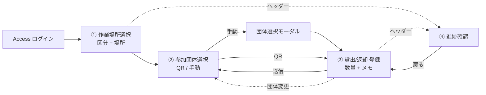
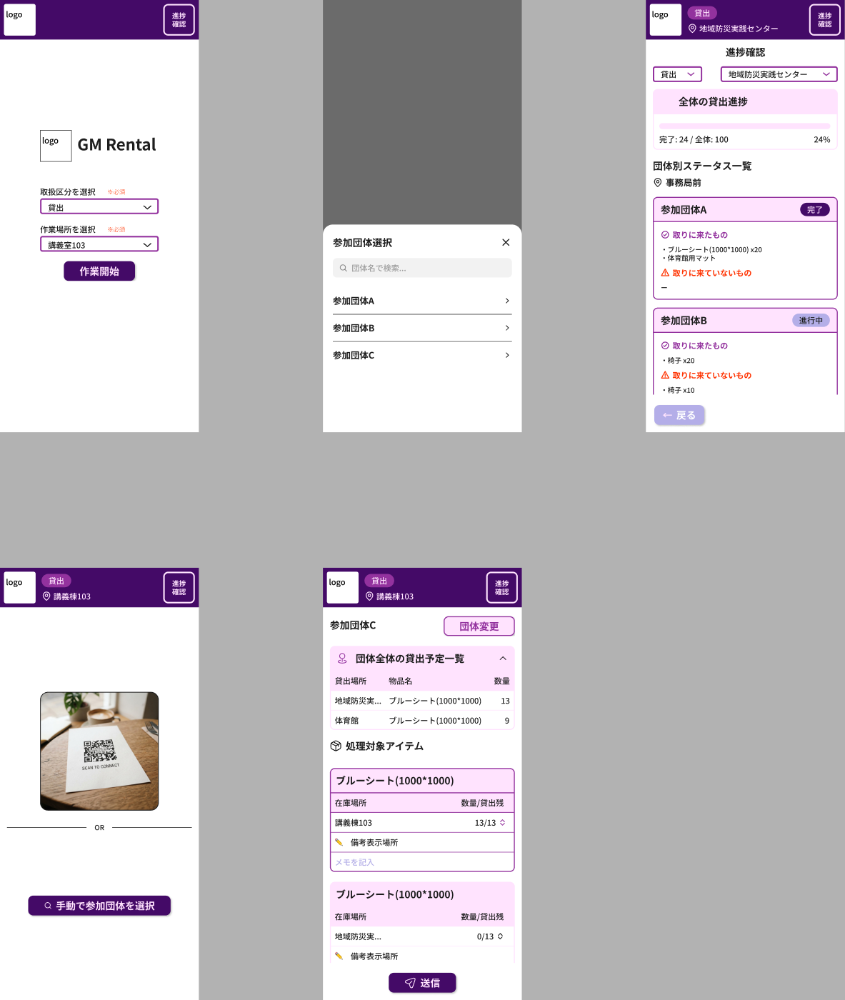
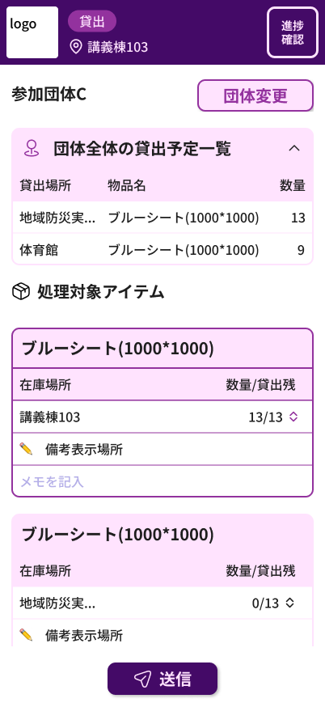
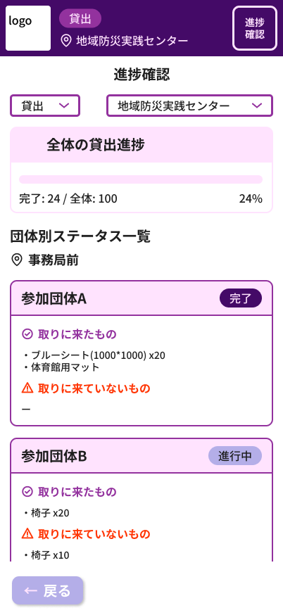
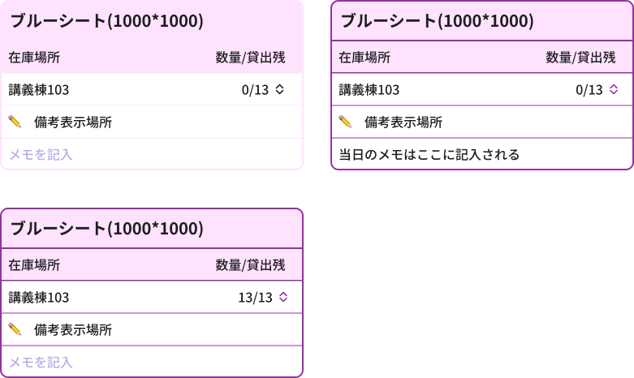
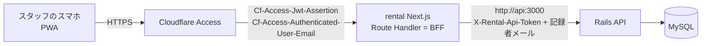
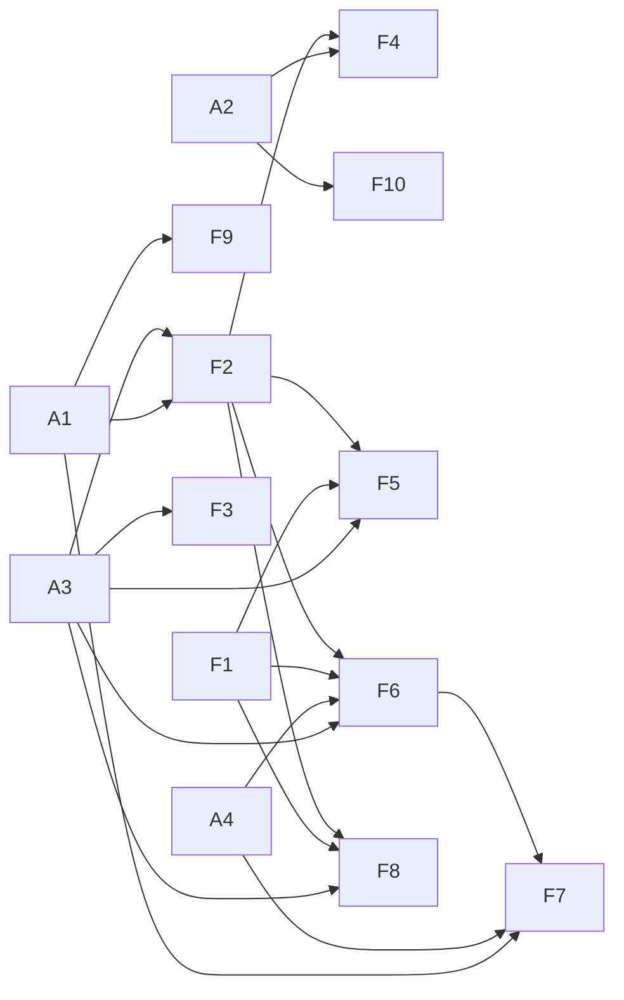

# GM Rental 設計書

学園祭当日、物品の貸出・返却をスマホで記録するアプリの体験と API 方針をまとめる。

| 項目 | 内容 |
| --- | --- |
| 版 | v0.1 |
| 日付 | 2026-09-09 |
| 作成 | haruto-kamijo |
| 状態 | レビュー待ち |

この文書の目的は、体験・機能・API 方針について合意を取ることである。合意後、issue（親1 + フロント F1〜F10 + API A1〜A4）を起票し実装に入る。

## 目次

1. [概要](#1-概要)
2. [利用者と用語](#2-利用者と用語)
3. [ユーザー体験](#3-ユーザー体験)
4. [機能一覧](#4-機能一覧)
5. [データと集計ルール](#5-データと集計ルール)
6. [システム構成（API との接続）](#6-システム構成api-との接続)
7. [API 突合せ](#7-api-突合せ)
8. [決定事項](#8-決定事項)
9. [合意を求める事項](#9-合意を求める事項)
10. [実装計画](#10-実装計画)
11. [参考リンク](#11-参考リンク)

---

## 1. 概要

### 何を作るか

学園祭当日、物品の貸出場所に立つ実行委員スタッフが、参加団体に物品を渡した・返してもらった事実をスマホで記録するアプリ `rental/`（画面名 GM Rental）をつくる。

### なぜ必要か

現状は割当（誰に何をいくつ渡す予定か）までしか記録がない。当日「渡したか」「戻ったか」「誰が対応したか」はどこにも残らない。

### スコープ

ver.1 mobile の5画面を対象とする。

スコープ外: PC レイアウト、オフライン時の送信キュー、管理画面（admin_view）側の閲覧機能、団体側アプリの QR 表示（別 issue F10 として `user/` 側に切り出す）。

### 前提

Cloudflare Zero Trust（Access）で保護し、アプリ自体はログイン画面を持たない。API キー・.env は settings リポジトリで管理する。技術構成は Next.js 16 / React 19 / Tailwind 4 / pnpm、PWA。

## 2. 利用者と用語

利用者は、学園祭当日に貸出場所（講義棟103、地域防災実践センターなど）に立つ実行委員スタッフ。自分のスマホで PWA を開き、参加団体が取りに来た・返しに来たタイミングでその場で記録する。参加団体側は団体 QR を見せるだけで、このアプリは操作しない。

| 用語 | 意味 | データ |
| --- | --- | --- |
| 作業場所 | 貸出場所。例: 講義棟103、地域防災実践センター | `assign_rental_items.rental_place_id` → `stocker_places` |
| 在庫場所 | 物が保管されている場所 | `assign_rental_items.stocker_place_id` → `stocker_places` |
| 参加団体 | 今年度 = `UserPageSetting.first.fes_year` | `groups` |
| 割当 | 団体×物品×在庫場所。`num`=渡す予定数、`remark`=実行委員の備考（PR #2184） | `assign_rental_items` |
| 記録 | 当日の事実。`uid` 冪等キー、`category`=rental/return/absolute_adjustment、`quantity`、`recorder_email`、追加予定 `memo`（PR #2171） | `item_rental_logs` |
| 団体 QR | 24桁、全団体に自動生成 | `group_secrets.secret` |

## 3. ユーザー体験

### ① 作業場所選択

取扱区分（貸出/返却）と作業場所を選び「作業開始」。両方必須。以後ヘッダーに「貸出 / 📍講義棟103」を常時表示し、端末に保持して再訪時はスキップする。

### ② 参加団体選択

カメラで団体 QR を読む。読めないときは「手動で参加団体を選択」からボトムシートで検索・一覧する。候補は今年度の団体のうち、この作業場所に割当がある団体だけに絞る。

### ③ 貸出・返却 登録

団体名 + 団体変更を上部に表示。「団体全体の貸出予定一覧」（全場所の割当、折りたたみ）で全体像を把握する。「処理対象アイテム」= この作業場所で渡す割当だけをカード化する。カード構成: 物品名 / 在庫場所 / 数量・貸出残のステッパー / ✏️ 備考（実行委員の remark、表示専用）/ メモを記入（スタッフの当日メモ）。下部固定「送信」。返却モードは同じ UI で返却数を入れる。

### ④ 進捗確認

絞り込み（貸出・返却 / 拠点）。全体進捗バー（完了/全体、%）。団体別カード（未着手 / 進行中 / 完了、取りに来たもの・取りに来ていないもの）を表示する。

### 画面イメージ

Figma ver.1 mobile の5画面。左上: 作業場所選択、中上: 参加団体選択モーダル、右上: 進捗確認、左下: 参加団体選択(QR)、中下: 貸出-登録。

  
  

③ 貸出・返却 登録画面（左）、④ 進捗確認画面（右）。

アイテムカードの3状態。左上: 表示、右上: メモ入力後（当日のメモはここに記入される）、左下: 貸出残0の状態。

## 4. 機能一覧

| ID | 機能 | 内容 | 依存 |
| --- | --- | --- | --- |
| F1 | デザインシステム基盤と UI コンポーネント | Tailwind 4 `@theme` トークン、Noto Sans JP。Header / Badge / Button / Selector / AccordionCard / ItemCard / QuantityControl / BottomSheetModal / ProgressBar。`user/` の慣習（components/\<Name\>/{tsx,stories,index}、scaffdog、Storybook、Prettier import 順）を移植する。 | — |
| F2 | BFF 経由の API クライアントと型 | Route Handler が `SSR_API_URL` へ転送、camelCase 変換、`ApiResponse<T>`、SWR。 | A1, A3 |
| F3 | 作業場所選択と作業セッション | 画面①。localStorage 永続化、ヘッダー反映。 | A3 |
| F4 | QR スキャンによる団体選択 | `BarcodeDetector`（非対応時は zxing 等）、権限拒否時の導線。 | A2, F2 |
| F5 | 手動の団体選択モーダル | 検索 + 一覧。 | F1, F2, A3 |
| F6 | 貸出・返却登録画面 | 画面③。 | F1, F2, A3, A4 |
| F7 | 送信処理 | uid 生成、冪等 POST、部分失敗の再送、409 の扱い。 | F6, A1, A4 |
| F8 | 進捗確認 | クライアント集計。 | F1, F2, A3 |
| F9 | Route Handler での Access 認証情報の検証・転送 | `Cf-Access-Jwt-Assertion` を JWKS で検証し、メールを転送する。 | A1, #2188 |
| F10 | `user/` の確定画面に団体 QR を表示（gm3_user） | A2 のペイロード仕様に依存。#2157/#2158 と調整する。 | A2 |

## 5. データと集計ルール

送信 = 今回渡した・返した数を `rental` / `return` で1ログ記録する。カード1枚（`assign_rental_item` 1件）につき、1回の送信で最大1ログ。訂正時のみ `absolute_adjustment` を使う。

- **貸出済** = Σ rental（`absolute_adjustment` があればそれ以降で置換）
- **貸出残** = `num − 貸出済`
- **返却残** = `貸出済 − Σ return`

団体ステータス（場所ごと）: ログ0件なら未着手、一部のアイテムに貸出残があれば進行中、全アイテムの貸出残が0なら完了。返却モードは返却残で同様に判定する。

冪等性: `uid` はクライアント生成の UUID。再送は同内容なら 200、内容が違えば 409（別端末で記録済みの可能性があるため再取得を促す）を返す。

## 6. システム構成（API との接続）

ブラウザは API を直接呼ばない。Access の Cookie は rental ドメインにしか無く、API に識別情報を運べないためだ。BFF が JWT を検証し、API には BFF 専用トークンと記録者メールを渡す。CORS の変更は不要。トークン等は settings リポジトリの .env で管理する: `RENTAL_API_TOKEN`, `CF_ACCESS_TEAM_DOMAIN`, `CF_ACCESS_AUD`。

## 7. API 突合せ

**実装予定 API = PR #2171**（approve 済み・未マージ）。`item_rental_logs` テーブル、`POST /item_rental_logs`（uid 冪等、422/404/409）、`GET /item_rental_logs?rental_place_id=&group_id=` → logs + assign_rental_items（id のみ）を追加する。

### 揃っているもの

- ログの粒度（カード1枚 = assign 1件）と enum、冪等キー
- `GET /stocker_places`（place_category 込み）
- `GET /rental_items`
- `GET /groups`
- `GET /api/v1/get_groups_refinemented_by_current_fes_year`
- PR #2184 の `remark`

### ギャップ

| ID | 内容 | 影響 | 対応 |
| --- | --- | --- | --- |
| A1 | 認証の不整合（最重要） | PR #2171 のコントローラは `authenticate_api_user!` + `require_admin!`（devise_token_auth、role_id∈{1,2}）で記録者を `current_api_user.email` から取る。PR 説明の Cf-Access ヘッダ方式と食い違い、ログインの無い rental から呼べない。 | BFF トークン認証の concern を追加。記録者メールは `Cf-Access-Authenticated-User-Email` から取得する。 |
| A2 | QR → 団体解決 API が無い | `group_secrets` は develop にあるが読む API が無い。`feat/oguchan/2156-confirmed-info-api` の `get_confirmed_info_for_user_view/:group_id?secret=` は名前のみで id が無い。 | `GET /api/v1/rental/groups/by_secret?secret=` を追加。不一致は一律 404。`:secret` を filter_parameters に追加する。 |
| A3 | 登録画面のデータが名前付きで取れない | `GET /item_rental_logs` は id のみを返す。物品名・在庫場所名・貸出場所名・remark・団体名が無い。 | 名前を含めた rental 向けエンドポイントを追加（+ この場所に割当がある今年度団体一覧 + 作業場所候補）。今年度に限定する。 |
| A4 | メモの保存先が無い | 当日のスタッフメモを保存する列が無い。 | `item_rental_logs.memo`（text, null 可）を PR #2171 に追加。remark は上書きしない。 |

### 軽微な補足

- 進捗集計 API は無いが、v1 はクライアント集計で足りる（数百件規模）
- `assign_rental_items` に年度が無く、`groups.fes_year_id` 経由で絞る
- CORS は BFF なら変更不要
- 作業場所候補の定義は未決（9章「合意を求める事項」を参照）

## 8. 決定事項

| 事項 | 内容 | 状態 |
| --- | --- | --- |
| 認証 = BFF + サービストークン | 理由: Access の識別を API に運ぶ唯一の現実的な経路。CORS 不要。user/ と衝突しない。 | **決定済み** |
| 数量 = 差分ログ、訂正は絶対値 | 理由: PR #2171 の enum 設計と一致する。同時操作に強い。 | **決定済み** |
| メモ = item_rental_logs.memo を追加 | 理由: Figma で備考表示とメモ入力は別行。remark は実行委員の情報で当日の事実とは別。 | **決定済み** |
| issue は機能単位 | 親1 + F1〜F10 + A1〜A4 で起票する。 | **決定済み** |

## 9. 合意を求める事項

| 事項 | 内容 | 提案 | 状態 |
| --- | --- | --- | --- |
| QR ペイロード形式 | F4/F10 で共通の仕様が必要。 | secret 文字列のみ。URL にすると他アプリで開かれる。 | **要合意** |
| 作業場所候補の定義 | — | `assign_rental_items.rental_place_id` の distinct（今年度）。 | **要合意** |
| 返却フローの詳細 | 返却残の扱い、貸出していない物の返却（想定外）をどう扱うか。 | v1 は返却残の範囲内のみとする。 | **要合意** |
| absolute_adjustment の運用 | 誰がいつ使うか。 | v1 の UI からは出さない。訂正は API 直叩き、または管理画面の将来機能とする。 | **要合意** |
| オフライン時の扱い | — | v1 は送信失敗を明示し再送ボタンを出す。キューは持たない。 | **要合意** |
| 進捗集計のサーバ移行時期 | — | 団体数×物品数が数千を超えたら検討する。 | **要合意** |
| PR #2171 の取り込み順 | — | A1（認証差し替え）と A4（memo）を PR #2171 に含めてからマージ。A2/A3 は別 PR とする。 | **要合意** |
| F10（user/ 側 QR）の担当 | #2157/#2158 の担当者と調整が必要。 | — | **要合意** |

## 10. 実装計画

### 実装順の提案

1. A1 + A4 を PR #2171 に反映する
2. F1 と A3 / A2 を並行して進める
3. F2, F9 を実装する
4. F3, F5, F6 を実装する
5. F7, F8 を実装する
6. F4, F10 を実装する

環境課題 #2185〜#2189 は並行で消化する。

## 11. 参考リンク

### Figma

- [ver.1 mobile](https://www.figma.com/design/JS9YQ7kEjmf1fG7vV26Z33/?node-id=96-1468)
- [スタイル・コンポーネント](https://www.figma.com/design/JS9YQ7kEjmf1fG7vV26Z33/?node-id=2-774)

### PR / ブランチ

- PR #2181 環境構築（approve 済み）
- PR #2171 item_rental_logs API
- PR #2184 assign_rental_items.remark
- ブランチ `feat/oguchan/2156-confirmed-info-api`

### Issue

- #2168（API）
- #2177（環境）
- #2185〜#2189（環境の残課題）
- #2157/#2158（確定画面）

### リポジトリ

- [github.com/NUTFes/group-manager-2](https://github.com/NUTFes/group-manager-2)
