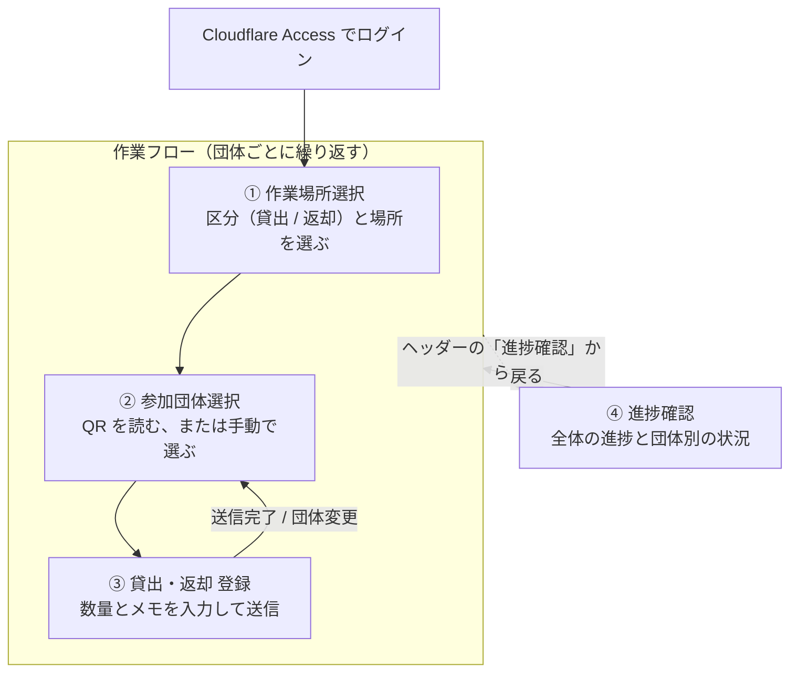
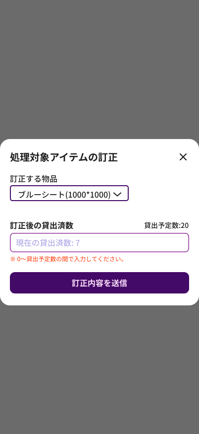
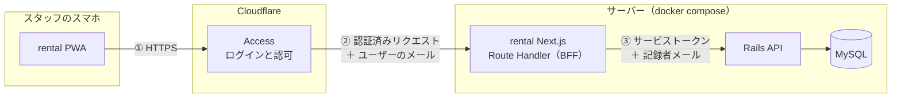
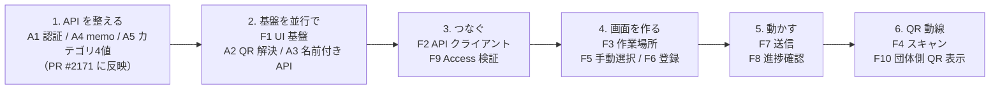

# GM Rental 設計書

学園祭当日、物品の貸出・返却をスマホで記録するアプリの体験と API 方針をまとめる。

| 項目 | 内容 |
| --- | --- |
| 版 | v0.6（v0.5 からの変更: Figma に追加された訂正モーダルを反映、A2 を PR #2182 の流用に、QR は PR #2183 の URL に統一） |
| 日付 | 2026-09-09 |
| 作成 | haruto-kamijo |
| 状態 | レビュー中 |

この文書の目的は、体験・機能・API 方針について合意を取ることである。合意後、issue（親1 + フロント F1〜F11 + API A1〜A5）を起票し実装に入る。

## 目次

1. [概要](#1-概要)
2. [利用者と用語](#2-利用者と用語)
3. [ユーザー体験](#3-ユーザー体験)
4. [機能一覧](#4-機能一覧)
5. [データと集計ルール](#5-データと集計ルール)
6. [システム構成（API との接続）](#6-システム構成api-との接続)
7. [API 突合せ](#7-api-突合せ)
8. [決定事項](#8-決定事項)
9. [合意を求める事項](#9-合意を求める事項)
10. [実装計画](#10-実装計画)
11. [参考リンク](#11-参考リンク)

---

## 1. 概要

### 何を作るか

学園祭当日、物品の貸出場所に立つ実行委員スタッフが、参加団体に物品を渡した・返してもらった事実をスマホで記録するアプリ `rental/`（画面名 GM Rental）をつくる。

### なぜ必要か

現状は割当（誰に何をいくつ渡す予定か）までしか記録がない。当日「渡したか」「戻ったか」「誰が対応したか」はどこにも残らない。

### スコープ

ver.1 mobile の6画面を対象とする（作業場所選択 / 参加団体選択 / 団体選択モーダル / 貸出・返却登録 / 訂正モーダル / 進捗確認）。

スコープ外: PC レイアウト、オフライン時の送信キュー、管理画面（admin_view）側の閲覧機能、メモの全件履歴表示、緊急時の割当変更（倉庫→参加団体）。団体側アプリの QR 表示は別 issue F10 として `user/` 側に切り出す。

技大祭までに必要最低限の機能を出すことを優先する。緊急時の割当変更は第一段階の完成後、デザイン修正と API 追加を経て実装する。

**v1 の運用上の注意**: ステッパーの上限は貸出残なので、当日「予定より多く渡す」場合は rental だけでは記録できない。admin_view の物品割り当てで割当（`assign_rental_items.num`）を直してから rental で記録する運用になる。

### 前提

Cloudflare Zero Trust（Access）で保護し、アプリ自体はログイン画面を持たない。API キー・.env は settings リポジトリで管理する。技術構成は Next.js 16 / React 19 / Tailwind 4 / pnpm、PWA。

## 2. 利用者と用語

利用者は、学園祭当日に貸出場所（講義棟103、地域防災実践センターなど）に立つ実行委員スタッフ。自分のスマホで PWA を開き、参加団体が取りに来た・返しに来たタイミングでその場で記録する。参加団体側は団体 QR を見せるだけで、このアプリは操作しない。

| 用語 | 意味 | データ |
| --- | --- | --- |
| 作業場所 | 貸出場所。例: 講義棟103、地域防災実践センター | `assign_rental_items.rental_place_id` → `stocker_places` |
| 在庫場所 | 物が保管されている場所 | `assign_rental_items.stocker_place_id` → `stocker_places` |
| 参加団体 | 今年度 = `UserPageSetting.first.fes_year` | `groups` |
| 割当 | 団体×物品×在庫場所。`num`=渡す予定数、`remark`=実行委員の備考（PR #2184） | `assign_rental_items` |
| 記録 | 当日の事実。`uid` 冪等キー、`category`=rental/return/rental_adjustment/return_adjustment、`quantity`、`recorder_email`、追加予定 `memo`（PR #2171） | `item_rental_logs` |
| 団体 QR | 24桁、全団体に自動生成 | `group_secrets.secret` |

## 3. ユーザー体験



②の「手動で選ぶ」はボトムシートのモーダルで行う（別画面ではなく②の一部）。④はどの画面からでもヘッダーから開け、「戻る」で元の画面に戻る。

### ① 作業場所選択

取扱区分（貸出/返却）と作業場所を選び「作業開始」。両方必須。以後ヘッダーに「貸出 / 📍講義棟103」を常時表示し、端末に保持して再訪時はスキップする。

### ② 参加団体選択

カメラで団体 QR を読む。読めないときは「手動で参加団体を選択」からボトムシートで検索・一覧する。候補は今年度の団体のうち、この作業場所に割当がある団体だけに絞る。

### ③ 貸出・返却 登録

団体名 + 団体変更を上部に表示。「団体全体の貸出予定一覧」（全場所の割当、折りたたみ）で全体像を把握する。「処理対象アイテム」= この作業場所で渡す割当だけをカード化する。カード構成: 物品名 / 在庫場所 / 数量・貸出残のステッパー / ✏️ 備考（実行委員の remark、表示専用）/ メモ（スタッフの当日メモ）。下部固定「送信」。返却モードは同じ UI で返却数を入れる。

**ステッパーの表記**は `今回入力する数量 / 貸出残`（返却モードでは `今回入力する数量 / 返却残`）。分母は入力の上限でもある。

**カードの選択と初期値**: カードは未選択のとき分子 0（`0/13`）で、タップして選択すると残数を流し込む（`13/13`）。そこから減らして調整する。「全部渡す」が大半なので選択だけで数量が決まり、部分的に渡すときだけ減らせばよい。Figma のカード状態と対応する。

| 状態 | Figma | 表示 | 意味 |
| --- | --- | --- | --- |
| 未選択 | `isEdit=false` | `0/13` | 今回は扱わない。送信対象外 |
| 選択 | `isEdit=true` | `13/13` | 残数が流し込まれた状態。ここから減らせる |
| メモ入り | `isEdit=memo` | メモ本文を表示 | 直近のメモを表示する |

数量を 0 まで減らしたカードは送信対象外とする（`QuantityControl` の `isZero=true` の見た目）。貸出残が 0 のカードは選択できない。

**メモ**は入力欄が「今回の送信に付けるメモ」で、カードには直近1件のメモを記録者と時刻付きで表示する。メモはログごとに付くため複数件たまるが、全件の履歴表示は v1 のスコープ外とする。

### ⑤ 訂正モーダル

「処理対象アイテム」見出しの右の「訂正する」ボタンから開く。誤って送信した数量を、その場で正しい累計に直す。

- **訂正する物品**: セレクターで選ぶ。候補はこの作業場所の処理対象アイテム
- **訂正後の貸出済数**: 正しい累計を直接入力する（差分ではない）。右上に「貸出予定数: 20」を参照表示し、入力欄のプレースホルダに「現在の貸出済数: 7」を出す
- **バリデーション**: 「※ 0〜貸出予定数の間で入力してください。」。上限はその割当の `num`、下限は 0
- **訂正内容を送信**: モードに応じて `rental_adjustment` / `return_adjustment` を1件記録する

返却モードでは「訂正後の返却済数」を入力し、上限は貸出済数になる（返却モードの画面はデザイン未整備。9 章を参照）。

### ④ 進捗確認

絞り込み（貸出・返却 / 拠点）。全体進捗バーは**団体ベース**で、完了した団体数 / 対象団体数と % を表示する（完了=1、進行中・未着手=0 の二値カウント）。当日スタッフの関心は「あと何団体残っているか」なので、アイテム数ではなく団体数で数える。団体別カード（未着手 / 進行中 / 完了、取りに来たもの・取りに来ていないもの）を表示する。

### 画面イメージ

Figma ver.1 mobile の6画面。左上: 作業場所選択、中上: 参加団体選択モーダル、右上: 進捗確認、左下: 参加団体選択(QR)、中下: 貸出-登録、右下: 訂正モーダル。


<p>
  
  
  
</p>

③ 貸出・返却 登録画面（左）、⑤ 訂正モーダル（中）、④ 進捗確認画面（右）。

アイテムカードの3状態。左上: 未選択（`isEdit=false`、`0/13`）、右上: メモ入り（`isEdit=memo`）、左下: 選択済み（`isEdit=true`、残数を流し込んだ `13/13`）。


## 4. 機能一覧

| ID | 機能 | 内容 | 依存 |
| --- | --- | --- | --- |
| F1 | デザインシステム基盤と UI コンポーネント | Tailwind 4 `@theme` トークン、Noto Sans JP。Header / Badge / Button / Selector / AccordionCard / ItemCard / QuantityControl / BottomSheetModal / ProgressBar。`user/` の慣習（components/\<Name\>/{tsx,stories,index}、scaffdog、Storybook、Prettier import 順）を移植する。 | — |
| F2 | BFF 経由の API クライアントと型 | Route Handler が `SSR_API_URL` へ転送、camelCase 変換、`ApiResponse<T>`、SWR。 | A1, A3 |
| F3 | 作業場所選択と作業セッション | 画面①。localStorage 永続化、ヘッダー反映。 | A3 |
| F4 | QR スキャンによる団体選択 | `BarcodeDetector`（非対応時は zxing 等）、権限拒否時の導線。 | A2, F2 |
| F5 | 手動の団体選択モーダル | 検索 + 一覧。 | F1, F2, A3 |
| F6 | 貸出・返却登録画面 | 画面③。 | F1, F2, A3, A4 |
| F7 | 送信処理 | uid 生成、冪等 POST、部分失敗の再送、409 の扱い。 | F6, A1, A4 |
| F8 | 進捗確認 | クライアント集計。 | F1, F2, A3 |
| F9 | Route Handler での Access 認証情報の検証・転送 | `Cf-Access-Jwt-Assertion` を JWKS で検証し、メールを転送する。 | A1, #2188 |
| F10 | `user/` の確定画面に団体 QR を表示（gm3_user） | PR #2183 の `/confirmed?group_id=&secret=` を QR にする。#2157/#2158 の担当と調整する。 | PR #2183 |
| F11 | 記録の訂正モーダル | 「訂正する」ボタンから開くモーダル。物品を選び、正しい累計を入力して `rental_adjustment` / `return_adjustment` で記録する。上限は割当の `num`。 | F6, F7, A5 |

## 5. データと集計ルール

送信 = 今回渡した・返した数を `rental` / `return` で1ログ記録する。カード1枚（`assign_rental_item` 1件）につき、1回の送信で最大1ログ。訂正は `rental_adjustment` / `return_adjustment` を使う。

`category` は貸出・返却それぞれに通常記録と訂正を持つ4値とする。

```
category: rental | return | rental_adjustment | return_adjustment
```

- **貸出済** = 直近の `rental_adjustment` の値 + それより後の Σ rental（`rental_adjustment` が無ければ Σ rental）
- **貸出残** = `num − 貸出済`
- **返却済** = 直近の `return_adjustment` の値 + それより後の Σ return（`return_adjustment` が無ければ Σ return）
- **返却残** = `貸出済 − 返却済`

貸出と返却で式が対称になる。`*_adjustment` は累計そのものを上書きする。差分ではない。上書き後の通常記録はその値に加算する。ログの順序は `created_at`（同時刻は `id`）で判定する。

③画面は貸出モードと返却モードで分岐しているため、訂正時に送るカテゴリはモードから一意に決まる。対象区分を別のフィールドで持たせる必要はない。

複数回訂正した場合の例（貸出の場合）:

| # | ログ | 貸出済 | 計算 |
| --- | --- | --- | --- |
| 1 | rental +3 | 3 | 0 + 3 |
| 2 | rental +2 | 5 | 3 + 2 |
| 3 | rental_adjustment = 4 | 4 | 上書き |
| 4 | rental +1 | 5 | 4 + 1 |
| 5 | rental_adjustment = 10 | 10 | 上書き |
| 6 | rental +1 | 11 | 10 + 1 |

### 訂正方式の選択

訂正のやり方には2案ある。

| 案 | 内容 | 長所 | 短所 |
| --- | --- | --- | --- |
| A. 過去ログの部分訂正 | 誤ったログ1件を特定して書き換える、または打ち消しログを積む | どの受け渡しが誤りだったかが残る | ログが追記のみでなくなる（書き換える場合）。UI で対象ログを選ばせる必要があり、当日の運用では負担が大きい |
| **B. 合算の上書き（採用）** | 現在の累計を正しい値で記録し直す | ログは追記のみで、過去の記録を書き換えない。入力は「正しい合計」1つで済む | どの受け渡しが誤りだったかは特定できない |

ログを残す観点から B を採る。上の式と計算例は B に基づく。A が必要になるのは「誰の対応分が誤りだったか」を後から追う要件が出たときで、その場合も B のログは残るため、後から A を足すことはできる。

団体ステータス（場所ごと）: ログ0件なら未着手、一部のアイテムに貸出残があれば進行中、全アイテムの貸出残が0なら完了。返却モードは返却残で同様に判定する。

全体進捗（場所・区分ごと）= 完了した団体数 ÷ 対象団体数。団体ステータスを完了=1、進行中・未着手=0 の二値でカウントする。アイテム数ベースにはしない（「あと何団体残っているか」を見るため）。

冪等性: `uid` はクライアント生成の UUID。再送は同内容なら 200、内容が違えば 409（別端末で記録済みの可能性があるため再取得を促す）を返す。

## 6. システム構成（API との接続）



| 区間 | 何を渡すか | 補足 |
| --- | --- | --- |
| ① スマホ → Access | 通常の HTTPS リクエスト | Access 未ログインならログイン画面へ |
| ② Access → BFF | `Cf-Access-Jwt-Assertion`、`Cf-Access-Authenticated-User-Email` | BFF が JWT を JWKS で検証する（F9） |
| ③ BFF → API | `X-Rental-Api-Token`（BFF 専用）、記録者メール | `http://api:3000` を compose ネットワーク内で呼ぶ（A1） |

ブラウザは API を直接呼ばない。Access の Cookie は rental ドメインにしか無く、API に識別情報を運べないためだ。CORS の変更は不要。トークン等は settings リポジトリの .env で管理する: `RENTAL_API_TOKEN`, `CF_ACCESS_TEAM_DOMAIN`, `CF_ACCESS_AUD`。

## 7. API 突合せ

**実装予定 API = PR #2171**（approve 済み・未マージ）。`item_rental_logs` テーブル、`POST /item_rental_logs`（uid 冪等、422/404/409）、`GET /item_rental_logs?rental_place_id=&group_id=` → logs + assign_rental_items（id のみ）を追加する。

### 揃っているもの

- ログの粒度（カード1枚 = assign 1件）と enum、冪等キー
- `GET /stocker_places`（place_category 込み）
- `GET /rental_items`
- `GET /groups`
- `GET /api/v1/get_groups_refinemented_by_current_fes_year`
- PR #2184 の `remark`

### ギャップ

| ID | 内容 | 影響 | 対応 |
| --- | --- | --- | --- |
| A1 | 認証の不整合（最重要） | PR #2171 のコントローラは `authenticate_api_user!` + `require_admin!`（devise_token_auth、role_id∈{1,2}）で記録者を `current_api_user.email` から取る。PR 説明の Cf-Access ヘッダ方式と食い違い、ログインの無い rental から呼べない。 | BFF トークン認証の concern を追加。記録者メールは `Cf-Access-Authenticated-User-Email` から取得する。 |
| A2 | QR → 団体解決 API が無い | `group_secrets` は develop にあるが読む API が無い。 | **PR #2182（approve 済み・未マージ）の `GET /api/v1/get_confirmed_info_for_user_view/:group_id?secret=` を流用できる。** 戻り値に `group: {id, name}` が含まれ、不一致は一律 404、`:secret` の filter_parameters 追加も済んでいる。新規エンドポイントは不要と判断。 |
| A3 | 登録画面のデータが名前付きで取れない | `GET /item_rental_logs` は id のみを返す。物品名・在庫場所名・貸出場所名・remark・団体名が無い。 | 名前を含めた rental 向けエンドポイントを追加（+ この場所に割当がある今年度団体一覧 + 作業場所候補）。今年度に限定する。 |
| A4 | メモの保存先が無い | 当日のスタッフメモを保存する列が無い。 | `item_rental_logs.memo`（text, null 可）を PR #2171 に追加。remark は上書きしない。 |
| A5 | 返却の訂正ができない | `category` が `absolute_adjustment` の1値のため、貸出・返却どちらの訂正か判別できない。 | `category` を `rental` / `return` / `rental_adjustment` / `return_adjustment` の4値にする。未マージなので `absolute_adjustment:2` → `rental_adjustment:2` のリネームと `return_adjustment:3` の追加で済む。 |

### 軽微な補足

- 進捗集計 API は無いが、v1 はクライアント集計で足りる（数百件規模）
- `assign_rental_items` に年度が無く、`groups.fes_year_id` 経由で絞る
- CORS は BFF なら変更不要
- 作業場所候補の定義は未決（9章「合意を求める事項」を参照）

## 8. 決定事項

| 事項 | 内容 | 状態 |
| --- | --- | --- |
| 認証 = BFF + サービストークン | 理由: Access の識別を API に運ぶ唯一の現実的な経路。CORS 不要。user/ と衝突しない。 | **決定済み** |
| 数量 = 差分ログ、訂正は累計の上書き | 理由: ログを追記のみに保てる。比較は 5 章「訂正方式の選択」。 | **決定済み** |
| カテゴリは4値 | `rental` / `return` / `rental_adjustment` / `return_adjustment`。理由: 貸出・返却で集計式が対称になり、区分フィールドを足すより実装が単純。訂正時のカテゴリは③画面のモードから一意に決まる。 | **決定済み** |
| メモ = item_rental_logs.memo を追加 | 理由: Figma で備考表示とメモ入力は別行。remark は実行委員の情報で当日の事実とは別。表示は直近1件（3 章③）。 | **決定済み** |
| ステッパーは選択で残数を流し込む | 未選択は `0/13`、選択で `13/13`。理由: 「全部渡す」が大半なので選択だけで数量が決まり、Figma の `isEdit` 2状態と対応する。 | **決定済み** |
| 訂正はモーダルで累計を直接入力 | 「訂正する」ボタン → 物品を選び「訂正後の貸出済数」を入力。上限は割当の `num`、下限は 0。デザインは Figma に追加済み（3 章⑤）。 | **決定済み** |
| issue は機能単位 | 親1 + F1〜F11 + A1〜A5 で起票する。 | **決定済み** |

## 9. 合意を求める事項

| 事項 | 内容 | 提案 | 状態 |
| --- | --- | --- | --- |
| 作業場所候補の定義 | — | `assign_rental_items.rental_place_id` の distinct（今年度）。 | **要合意** |
| 返却フローの詳細 | 返却残の扱い、貸出していない物の返却（想定外）をどう扱うか。 | v1 は返却残の範囲内のみとする。 | **要合意** |
| 返却モードの訂正モーダル | 訂正モーダルは貸出モードのデザインのみ。返却モードでは「訂正後の返却済数」を入力し、上限が貸出済数になる。 | 貸出モードのデザインを踏襲し、ラベルと上限だけ差し替える。デザイン追加は不要と判断してよいか確認したい。 | **要合意** |
| QR ペイロード形式 → PR #2183 との統一 | PR #2183（#2157）が `GET /confirmed?group_id=&secret=` という URL を QR で配る設計で実装済み。 | 団体 QR はこの URL に統一し、rental はスキャン結果の URL から `group_id` と `secret` を取り出す。団体は1つの QR で「確定情報を見る」「窓口で提示する」の両方ができる。 | **要合意** |
| 緊急時の割当変更（倉庫→参加団体） | 当日、予定より多く渡す場合の割当変更。 | 第一段階の完成後に、デザイン修正と API 追加を経て実装する（v1 スコープ外）。v1 は admin_view で割当を直す運用で回す。 | **暫定合意** |
| オフライン時の扱い | — | v1 は送信失敗を明示し再送ボタンを出す。キューは持たない。 | **要合意** |
| 進捗集計のサーバ移行時期 | — | 団体数×物品数が数千を超えたら検討する。 | **要合意** |
| PR #2171 の取り込み順 | — | A1（認証差し替え）、A4（memo）、A5（カテゴリ4値）を PR #2171 に含めてからマージ。A2/A3 は別 PR とする。 | **要合意** |
| F10（user/ 側 QR）の担当 | #2157/#2158 の担当者と調整が必要。 | — | **要合意** |

## 10. 実装計画



各段階は前の段階の成果に依存する。個々の依存関係は 4 章「機能一覧」の「依存」列を参照。

- 1 は PR #2171 のマージ前に済ませる（マージ後だと API の差し替えが二度手間になる）
- 2 は API とフロントを別の人が並行で進められる
- 6 は QR ペイロード形式の合意（9 章）が前提
- F11（訂正モーダル）はデザインが確定したので、5 の後に着手する
- A2 は PR #2182 のエンドポイント流用で済む見込みなので、2 の作業量は当初想定より小さい
- 環境課題 #2185〜#2189 は並行で消化する

## 11. 参考リンク

### Figma

- [ver.1 mobile](https://www.figma.com/design/JS9YQ7kEjmf1fG7vV26Z33/?node-id=96-1468)
- [スタイル・コンポーネント](https://www.figma.com/design/JS9YQ7kEjmf1fG7vV26Z33/?node-id=2-774)

### PR / ブランチ

- PR #2181 環境構築（approve 済み）
- PR #2171 item_rental_logs API
- PR #2184 assign_rental_items.remark
- PR #2182 確定情報 API（approve 済み・未マージ、A2 で流用）
- PR #2183 確定情報のユーザー向け画面（QR で配る URL `/confirmed?group_id=&secret=`）
- PR #2192 rental/ のローカル開発環境の修正（#2185 の対応）

### Issue

- #2168（API）
- #2177（環境）
- #2185〜#2189（環境の残課題）
- #2157/#2158（確定画面）

### リポジトリ

- [github.com/NUTFes/group-manager-2](https://github.com/NUTFes/group-manager-2)
