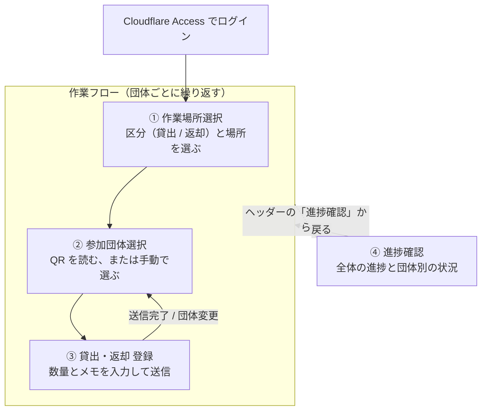
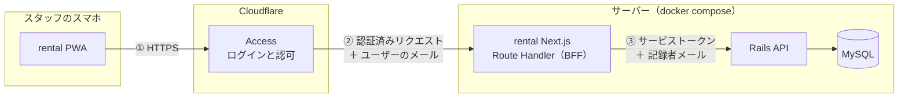
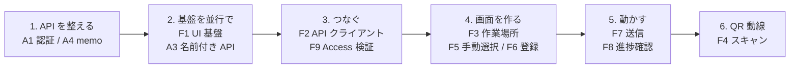

# GM Rental 設計書

学園祭当日、物品の貸出・返却をスマホで記録するアプリの体験と API 方針をまとめる。

| 項目 | 内容 |
| --- | --- |
| 版 | v1.0（PoC実装完了。F1〜F11 と A1/A3/A4 を実装し、割当変更の集計はA3のレスポンス同梱で解決） |
| 日付 | 2026-09-14（初版 2026-09-09） |
| 作成 | haruto-kamijo |
| 状態 | PoC実装完了（実機確認待ち） |

この文書の目的は、体験・機能・API 方針について合意を取ることである。合意は PR #2190 で得られ、issue（親 #2203 + フロント F1〜F11 + API A1〜A5）を起票して PoC の実装を完了した。

## 目次

1. [概要](#1-概要)
2. [利用者と用語](#2-利用者と用語)
3. [ユーザー体験](#3-ユーザー体験)
4. [機能一覧](#4-機能一覧)
5. [データと集計ルール](#5-データと集計ルール)
6. [システム構成（API との接続）](#6-システム構成api-との接続)
7. [API 突合せ](#7-api-突合せ)
8. [決定事項](#8-決定事項)
9. [合意を求める事項](#9-合意を求める事項)
10. [実装計画](#10-実装計画)
11. [参考リンク](#11-参考リンク)

---

## 1. 概要

### 何を作るか

学園祭当日、物品の貸出場所に立つ実行委員スタッフが、参加団体に物品を渡した・返してもらった事実をスマホで記録するアプリ `rental/`（画面名 GM Rental）をつくる。

### なぜ必要か

現状は割当（誰に何をいくつ渡す予定か）までしか記録がない。当日「渡したか」「戻ったか」「誰が対応したか」はどこにも残らない。

### スコープ

ver.1 mobile の6画面を対象とする（作業場所選択 / 参加団体選択 / 団体選択モーダル / 貸出・返却登録 / 訂正モーダル / 進捗確認）。

スコープ外: PC レイアウト、オフライン時の送信キュー、管理画面（admin_view）側の閲覧機能、メモの全件履歴表示。団体側アプリの QR 表示は別 issue F10 として `user/` 側に切り出した（#2202 で実装済み）。

技大祭までに必要最低限の機能を出すことを優先する。緊急時の割当変更（予定より多く渡す場合）は当初スコープ外としていたが、当日 admin_view を開いて割当を直す運用は現実的でないため、PoC で「例外対応」として実装した（#2225）。

**予定より多く渡す場合**: 数量の上限は貸出残なので、通常のカードでは記録できない。「例外対応」→「超過貸出」で、提供元の団体から割当を減らし（`reduction`）対象団体に足す（`addition`）ことで記録する。実効割当数 = `num` + Σaddition − Σreduction（5 章）。

### 前提

Cloudflare Zero Trust（Access）で保護し、アプリ自体はログイン画面を持たない。API キー・.env は settings リポジトリで管理する。技術構成は Next.js 16 / React 19 / Tailwind 4 / pnpm、PWA。

環境構築（#2181）とその残課題（#2185〜#2189）はすべてマージ済みである。

## 2. 利用者と用語

利用者は、学園祭当日に貸出場所（講義棟103、地域防災実践センターなど）に立つ実行委員スタッフ。自分のスマホで PWA を開き、参加団体が取りに来た・返しに来たタイミングでその場で記録する。参加団体側は団体 QR を見せるだけで、このアプリは操作しない。

| 用語 | 意味 | データ |
| --- | --- | --- |
| 作業場所 | 貸出場所。例: 講義棟103、地域防災実践センター | `assign_rental_items.rental_place_id` → `stocker_places` |
| 在庫場所 | 物が保管されている場所 | `assign_rental_items.stocker_place_id` → `stocker_places` |
| 参加団体 | 今年度 = `UserPageSetting.first.fes_year` | `groups` |
| 割当 | 団体×物品×在庫場所。`num`=渡す予定数、`remark`=実行委員の備考（PR #2184） | `assign_rental_items` |
| 記録 | 当日の事実。`uid` 冪等キー、`category`=rental/return/rental_absolute/return_absolute/addition/reduction の6値（`absolute_adjustment` は廃止値として残存、新規作成は 422）、`quantity`、`recorder_email`、`group_id`。`addition`/`reduction` は `assign_rental_item_id` が NULL。`memo` は未実装（A4） | `item_rental_logs` |
| 割当変更 | 団体間で割当を追加・削減した記録 | `item_rental_logs` の `addition`/`reduction` |
| 団体 QR | 24桁、全団体に自動生成 | `group_secrets.secret` |

## 3. ユーザー体験



②の「手動で選ぶ」はボトムシートのモーダルで行う（別画面ではなく②の一部）。④はどの画面からでもヘッダーから開け、「戻る」で元の画面に戻る。

ヘッダーのロゴはどの画面からでも①（取扱区分・作業場所の選択）へ戻る。場所や区分を変えるのはここだけなので、迷ったらロゴで最初に戻れるようにしている。

### ① 作業場所選択

取扱区分（貸出/返却）と作業場所を選び「作業開始」。両方必須。以後ヘッダーに「貸出 / 📍講義棟103」を常時表示し、端末に保持して再訪時はスキップする。

### ② 参加団体選択

カメラで団体 QR を読む。読めないときは「手動で参加団体を選択」からボトムシートで検索・一覧する。候補は今年度の団体のうち、この作業場所に割当がある団体だけに絞る。

### ③ 貸出・返却 登録

団体名 + 団体変更を上部に表示。「団体変更」は②へ戻る（次の団体は QR で読むのが通常の流れなので、カメラのある画面に戻す）。「団体全体の貸出予定一覧」（全場所の割当、折りたたみ）で全体像を把握する。「処理対象アイテム」= この作業場所で渡す割当だけをカード化する。カード構成: 物品名 / 在庫場所 / 数量・貸出残の数量入力 / ✏️ 備考（実行委員の remark、表示専用）/ メモ（スタッフの当日メモ）。下部固定「送信」。返却モードは同じ UI で返却数を入れる。

**数量の表記**は `今回入力する数量 / 貸出残`（返却モードでは `今回入力する数量 / 返却残`）。分母は入力の上限でもある。

**カードの選択と初期値**: カードは未選択のとき分子 0（`0/13`）で、タップして選択すると残数を流し込む（`13/13`）。そこから減らして調整する。「全部渡す」が大半なので選択だけで数量が決まり、部分的に渡すときだけ減らせばよい。Figma のカード状態と対応する。

| 状態 | Figma | 表示 | 意味 |
| --- | --- | --- | --- |
| 未選択 | `isEdit=false` | `0/13` | 今回は扱わない。送信対象外 |
| 選択 | `isEdit=true` | `13/13` | 残数が流し込まれた状態。ここから減らせる |
| メモ入り | `isEdit=memo` | メモ本文を表示 | 直近のメモを表示する |

数量を 0 まで減らしたカードは送信対象外とする（`QuantityControl` の `isZero=true` の見た目）。貸出残が 0 のカードは選択できない。ただし**メモだけ書いたカードは数量 0 でも送信対象に含める**。「来たが受け取らなかった」のような事実をメモだけで残せるようにするため、メモ欄は選択状態と独立して入力できる（Figma も同じ扱い）。

**Figma との差分（レビュー済み）**:

| 箇所 | Figma | 実装 | 理由 |
| --- | --- | --- | --- |
| 数量の入力 | 上下ボタン（`⇅`）のみ | 0〜残数のプルダウン + ＋－ ボタン | 13個渡すのに13回タップすることになるため。プルダウンはスマホで OS のピッカーが出るので、数字キーボードを開かずに一度で選べる。＋－ はピッカーを開かずに ±1 するために残した |
| 選択状態の表現 | カード枠の塗り分け | カード左のチェックボックス | 選択できる／している ことが一目で分かるようにするため |

**メモ**は入力欄が「今回の送信に付けるメモ」で、カードには直近1件のメモを記録者と時刻付きで表示する。メモはログごとに付くため複数件たまるが、全件の履歴表示は v1 のスコープ外とする。

### ⑤ 訂正モーダル

「処理対象アイテム」見出しの右の「訂正する」ボタンから開く。誤って送信した数量を、その場で正しい累計に直す。

- **訂正する物品**: セレクターで選ぶ。候補はこの作業場所の処理対象アイテム
- **訂正後の貸出済数**: 正しい累計を直接入力する（差分ではない）。右上に「貸出予定数: 20」を参照表示し、入力欄のプレースホルダに「現在の貸出済数: 7」を出す
- **バリデーション**: 「※ 0〜貸出予定数の間で入力してください。」。上限はその割当の `num`、下限は 0
- **訂正内容を送信**: モードに応じて `rental_absolute` / `return_absolute` を1件記録する

返却モードでは「訂正後の返却済数」を入力し、上限は貸出済数になる（返却モードの画面はデザイン未整備。9 章を参照）。

### ④ 進捗確認

絞り込み（貸出・返却 / 拠点）。全体進捗バーは**団体ベース**で、完了した団体数 / 対象団体数と % を表示する（完了=1、進行中・未着手=0 の二値カウント）。当日スタッフの関心は「あと何団体残っているか」なので、アイテム数ではなく団体数で数える。団体別カード（未着手 / 進行中 / 完了、取りに来たもの・取りに来ていないもの）を表示する。

### 画面イメージ

Figma ver.1 mobile の6画面。左上: 作業場所選択、中上: 参加団体選択モーダル、右上: 進捗確認、左下: 参加団体選択(QR)、中下: 貸出-登録、右下: 訂正モーダル。


<p>
  
  
  
</p>

③ 貸出・返却 登録画面（左）、⑤ 訂正モーダル（中）、④ 進捗確認画面（右）。

アイテムカードの3状態。左上: 未選択（`isEdit=false`、`0/13`）、右上: メモ入り（`isEdit=memo`）、左下: 選択済み（`isEdit=true`、残数を流し込んだ `13/13`）。


## 4. 機能一覧

| ID | 機能 | 内容 | 依存 |
| --- | --- | --- | --- |
| F1 | デザインシステム基盤と UI コンポーネント | Tailwind 4 `@theme` トークン、Noto Sans JP。Header / Badge / Button / Selector / AccordionCard / ItemCard / QuantityControl / BottomSheetModal / ProgressBar。`user/` の慣習（components/\<Name\>/{tsx,stories,index}、scaffdog、Storybook、Prettier import 順）を移植する。 | — |
| F2 | BFF 経由の API クライアントと型 | Route Handler が `SSR_API_URL` へ転送、camelCase 変換、`ApiResponse<T>`、SWR。 | A1, A3 |
| F3 | 作業場所選択と作業セッション | 画面①。localStorage 永続化、ヘッダー反映。作業場所には「すべての場所」を選べる（倉庫をまたいで対応する係や例外対応をまとめて行う場合に使う。`placeId` は null）。 | A3 |
| F4 | QR スキャンによる団体選択 | `BarcodeDetector`（非対応時は zxing 等）、権限拒否時の導線。団体 QR は `/confirmed?group_id=&secret=` の URL（#2193 がサーバー側で生成）。スキャン結果の URL から `group_id` と `secret` を取り出し、#2182 のエンドポイントで照合する。 | F2 |
| F5 | 手動の団体選択モーダル | 検索 + 一覧。 | F1, F2, A3 |
| F6 | 貸出・返却登録画面 | 画面③。割当変更の取得には `group_id` のみのクエリが別途必要（5 章参照）。 | F1, F2, A3, A4 |
| F7 | 送信処理 | uid 生成、冪等 POST、部分失敗の再送、409 の扱い。**中身を変えずに送り直すときは同じ uid**（通信エラーの再送を冪等にする）、**カードを編集したら別の操作として uid を取り直す**（編集が反映されないまま同じ内容を送り続けないため）。409 は「同じ操作が別の内容で記録済み」なので成功扱いにせず、入れ直しを促す。送信できたときだけ画面②へ戻り、そこに「登録が完了しました」を出す（失敗時は画面③に留まるので、送ったつもりで送れていない状態と区別できる）。 | F6, A1, A4 |
| F8 | 進捗確認 | クライアント集計。割当変更の取得には `group_id` のみのクエリが別途必要（5 章参照）。 | F1, F2, A3 |
| F9 | Route Handler での Access 認証情報の検証・転送 | `Cf-Access-Jwt-Assertion` を JWKS で検証し、メールを転送する。 | A1, #2188 |
| F10 | `user/` の確定画面に団体 QR を表示（gm3_user） | **実装済み（#2202）**。PR #2183 の `/confirmed?group_id=&secret=` を QR コードで表示する。 | 完了 |
| F11 | 記録の訂正モーダル | 「訂正する」ボタンから開くモーダル。物品を選び、正しい累計を入力して `rental_absolute` / `return_absolute` で記録する。上限は割当の `num`。 | F6, F7 |

## 5. データと集計ルール

送信 = 今回渡した・返した数を `rental` / `return` で1ログ記録する。カード1枚（`assign_rental_item` 1件）につき、1回の送信で最大1ログ。訂正は `rental_absolute` / `return_absolute` を使う。

`category` は貸出・返却それぞれに通常記録と訂正を持つ6値とする。旧 `absolute_adjustment` は廃止値として enum に残っているが、新規作成は 422 になる。

```
category: rental | return | rental_absolute | return_absolute | addition | reduction
```

- **貸出済** = 直近の `rental_absolute` の値 + それより後の Σ rental（`rental_absolute` が無ければ Σ rental）
- **返却済** = 直近の `return_absolute` の値 + それより後の Σ return（`return_absolute` が無ければ Σ return）
- **実効割当数（提案）** = `assign_rental_items.num` + Σ addition − Σ reduction。割当変更をどう集計に織り込むかは 9 章の要合意事項
- **貸出中** = 貸出済 − 返却済
- **貸出残** = 実効割当数 − 貸出中（= 実効割当数 − 貸出済 + 返却済）
- **返却残** = 貸出中（= 貸出済 − 返却済）

**返した物はまた貸し出せる。** 同じ物が戻ってくるため、返却済のぶんは貸出残に戻す。5個の割当を5個渡して5個返してもらったら、また5個渡せる。貸出済・返却済は累計なので、この場合 貸出済10 / 返却済5 まで伸びうる（`rental_absolute` の上限も 実効割当数 ＋ 返却済 になる）。

貸出と返却で式が対称になる。`*_absolute` は累計そのものを上書きする。差分ではない。上書き後の通常記録はその値に加算する。ログの順序は `created_at`（同時刻は `id`）で判定する。

③画面は貸出モードと返却モードで分岐しているため、訂正時に送るカテゴリはモードから一意に決まる。対象区分を別のフィールドで持たせる必要はない。

複数回訂正した場合の例（貸出の場合）:

| # | ログ | 貸出済 | 計算 |
| --- | --- | --- | --- |
| 1 | rental +3 | 3 | 0 + 3 |
| 2 | rental +2 | 5 | 3 + 2 |
| 3 | rental_absolute = 4 | 4 | 上書き |
| 4 | rental +1 | 5 | 4 + 1 |
| 5 | rental_absolute = 10 | 10 | 上書き |
| 6 | rental +1 | 11 | 10 + 1 |

### 訂正方式の選択

訂正のやり方には2案ある。

| 案 | 内容 | 長所 | 短所 |
| --- | --- | --- | --- |
| A. 過去ログの部分訂正 | 誤ったログ1件を特定して書き換える、または打ち消しログを積む | どの受け渡しが誤りだったかが残る | ログが追記のみでなくなる（書き換える場合）。UI で対象ログを選ばせる必要があり、当日の運用では負担が大きい |
| **B. 合算の上書き（採用）** | 現在の累計を正しい値で記録し直す | ログは追記のみで、過去の記録を書き換えない。入力は「正しい合計」1つで済む | どの受け渡しが誤りだったかは特定できない |

ログを残す観点から B を採る。上の式と計算例は B に基づく。A が必要になるのは「誰の対応分が誤りだったか」を後から追う要件が出たときで、その場合も B のログは残るため、後から A を足すことはできる。

団体ステータス（場所ごと）: ログ0件なら未着手、一部のアイテムに貸出残があれば進行中、全アイテムの貸出残が0なら完了。返却モードは返却残で同様に判定する。

全体進捗（場所・区分ごと）= 完了した団体数 ÷ 対象団体数。団体ステータスを完了=1、進行中・未着手=0 の二値でカウントする。アイテム数ベースにはしない（「あと何団体残っているか」を見るため）。

冪等性: `uid` はクライアント生成の UUID。再送は同内容なら 200、内容が違えば 409（別端末で記録済みの可能性があるため再取得を促す）を返す。

### 割当変更（addition / reduction）の扱い

API では `addition` / `reduction` として記録できる（#2198）。UI は登録画面の「例外対応」→「超過貸出」で、提供元の団体・物品・数量を選び、提供元に `reduction`、対象団体に `addition` を1件ずつ記録する（#2225 で実装済み）。2件は `uid` を `<uid>-reduction` / `<uid>-addition` として同じ操作から生成し、冪等性を保つ。

**上限はサーバー側でも確かめる。行ロックつきで。** 画面と BFF だけで制限していると、BFF 用のトークンさえあれば API を直接叩いて上限を無視した記録ができてしまう。`rental/src/lib/aggregate.ts` と同じ式を `AssignRentalItem`（`effective_num` / `lent_quantity` / `lent_remaining` / `return_remaining`）に持たせ、`ItemRentalLog` の作成時に検証する（#2224 のレビュー反映）。上限は `rental` = 貸出残、`return` = 返却残、`rental_absolute` = 実効割当数＋返却済、`return_absolute` = 貸出済数。超過貸出は割当1件では上限が決まらないため、`transfer` が提供元の未貸出数を確かめる。

検証は確認してから書くまでの間に別の端末が書き込めるため、**割当行を `FOR UPDATE` で押さえてから**行う（`create` は対象の割当、`transfer` は提供元の割当）。押さえないと、残り5個に対する5個の記録が2件同時に通って10個貸し出した記録になる。`addition` / `reduction` は単独では上限が決まらないうえ、片方だけ残ると在庫が消えたように見えるため、`POST /item_rental_logs` では受け付けず `transfer` 専用にしている。

**2件は必ず対で書く。** BFF から `POST /item_rental_logs` を2回呼ぶ形だと、`reduction` の後に `addition` が失敗したときに提供元の割当だけが減ったまま残り、在庫が消えたように見える。`POST /item_rental_logs/transfer` が1トランザクションで2件を作るようにし、片方でも失敗すれば何も残さない（#2230）。同じ `uid` の再送は既存の対をそのまま返し、内容が違えば 409。画面側も送信のたびに `uid` を作り直さず、入力が同じ間は同じ `uid` を使う（再送で割当を二重に動かさないため）。

**物品・在庫場所・団体はいずれもマスタの全件から選ぶ。** 当日は「この倉庫の分だけ」「予定していた物品だけ」では回らないため、例外対応は貸出場所でも割当でも絞らない（`get_rental_items_for_rental_view` / `get_stocker_places_for_rental_view` / `get_groups_for_rental_view`）。講義棟103で作業していても、余り在庫を持たせた団体（「余り」等）の講義棟104の机を選べる。選んだ組み合わせを提供元が持っていなければ未貸出数が0になり、その旨を画面に出して送信を止める。

**渡す先に割当が無くても渡せる。** もともと申請していない物品を渡す場合、`addition` を足す先も、渡した分を記録する先（記録は `assign_rental_item` に紐づく）も無い。`transfer` が渡す先の割当を `num` 0・貸出場所は作業中の場所で作り、実効割当数が `addition` のぶんだけ増えるようにする。既にある割当には手を入れない。

**回せる数量の上限 = 提供元の未貸出数**（`Σ（実効割当数 − 貸出済数）`、物品と在庫場所が一致する割当の合計）。既に渡した分は提供元の手元に無いので動かせない。12個予定で3個渡した団体からは9個までしか回せない。画面に「元の団体の未貸出数」を出して入力を制限し、別端末の記録で残数が変わっている場合に備えて BFF（`/api/rental/excess-lending`）でも送信時に同じ上限を確かめ、超えていれば 422 を返す。

**記録できたら Slack に流す。** 割当を人手で動かした事実は当日の判断材料になるため、`transfer` が成功したときに 物品 / 在庫場所 / 数量 / 貸出元・貸出先の団体名と割当数の変化（元の数 → 変更後の数）/ 記録者 を投稿する（既存の `Slack::Web::Client` と `BOT_USER_ACCESS_TOKEN` / `CHANNEL` をそのまま使う）。同じ uid の再送では記録が動かないため投稿しない。通知に失敗しても記録は成立させる。「元の数」は行ロックを取った後に読む（先に読むと、ほぼ同時の超過貸出で古い値を通知してしまう）。割当数は同一(団体×物品×在庫場所)の割当を合算した実効割当数を使う。

`addition` / `reduction` は `rental_place_id`（貸出場所）を持たないため、貸出場所で絞ったクエリでは返らない。A3 の読み取り API が対象団体の割当変更ログを `assignment_change_logs` として同じ応答に同梱することで解決した（9 章）。

## 6. システム構成（API との接続）



| 区間 | 何を渡すか | 補足 |
| --- | --- | --- |
| ① スマホ → Access | 通常の HTTPS リクエスト | Access 未ログインならログイン画面へ |
| ② Access → BFF | `Cf-Access-Jwt-Assertion`、`Cf-Access-Authenticated-User-Email` | BFF が JWT を JWKS で検証する（F9） |
| ③ BFF → API | `X-Rental-Api-Token`（BFF 専用）、記録者メール | `http://api:3000` を compose ネットワーク内で呼ぶ（A1） |

ブラウザは API を直接呼ばない。Access の Cookie は rental ドメインにしか無く、API に識別情報を運べないためだ。CORS の変更は不要。トークン等は settings リポジトリの .env で管理する: `RENTAL_API_TOKEN`, `CF_ACCESS_TEAM_DOMAIN`, `CF_ACCESS_AUD`。

### 認証は3層に分かれる

**A1 はログインの実装ではない。** 「人が誰か」を確かめるのは Cloudflare Access の役割で、A1 が担うのは「Access が済ませた認証結果を API まで運ぶ経路」と「運び手が正当かを API 側で確かめる手段」である。

| 層 | 何を確かめるか | 手段 | 状態 |
| --- | --- | --- | --- |
| ① 人（スタッフ） | 誰がアプリを開いているか | Cloudflare Access。アプリ側にログイン画面は持たない | Access ポリシー設定待ち |
| ② アプリ → API | 呼び出し元が rental の BFF か | 共有トークン `X-Rental-Api-Token`（A1） | 未実装 |
| ③ 記録者の特定 | 誰が記録したか | Access が付けた `Cf-Access-Authenticated-User-Email` を BFF が転送し `recorder_email` に入れる（A1） | 未実装 |

既存 API（`user/` と `admin_view/` が使う devise_token_auth の経路）には手を入れない。rental 向けのエンドポイントにのみ別の認証を足す。

**却下した案**: rental 用のサービスアカウントを作り、devise_token_auth でログインさせる方式。理由は2つ。

1. `recorder_email` がサービスアカウントのメールになり、「誰が渡したか」が残らない。当日のトラブル対応で必要になる情報が失われる
2. `token_lifespan` が2週間のため、期限切れ時の再ログイン処理を BFF に実装することになる

共有トークン + メール転送なら、認証の主体は Access のままで、API は「正当な BFF からの呼び出しか」だけを見れば済む。

## 7. API 突合せ

**#2171 と #2198 がマージ済み**。`item_rental_logs` テーブルは `uid`（unique）、`stocker_place_id`（NOT NULL）、`rental_item_id`（NOT NULL）、`assign_rental_item_id`（nullable）、`category`（NOT NULL）、`quantity`（NOT NULL）、`recorder_email`（NOT NULL）、`group_id`（NOT NULL）を持つ。`memo` カラムは無い。`category` は `rental` / `return` / `rental_absolute` / `return_absolute` / `addition` / `reduction` の6値（旧 `absolute_adjustment` は廃止値、新規作成は 422）。`POST /item_rental_logs`（uid 冪等、422/404/409）、`GET /item_rental_logs?rental_place_id=&group_id=`（logs + assign_rental_items（id のみ）、`addition`/`reduction` は `group_id` のみ指定時だけ含まれる）がある。

### 揃っているもの

- ログの粒度（カード1枚 = assign 1件）と enum、冪等キー
- `GET /stocker_places`（place_category 込み）
- `GET /rental_items`
- `GET /groups`
- `GET /api/v1/get_groups_refinemented_by_current_fes_year`
- `assign_rental_items.remark`（#2184 マージ済み）
- `GET /api/v1/get_confirmed_info_for_user_view`（#2182 マージ済み）
- `GET /api/v1/get_confirmed_qrcode_for_user_view`（#2193 マージ済み）
- `POST /item_rental_logs` / `GET /item_rental_logs`（#2171/#2198 マージ済み）
- `POST /item_rental_logs/transfer`（超過貸出。`reduction` と `addition` を1トランザクションで対にする。#2230）
- `GET /api/v1/get_rental_items_for_rental_view` / `GET /api/v1/get_stocker_places_for_rental_view`（例外対応の候補に使う物品・在庫場所のマスタ）

解消したギャップ:

- A2 → #2182 の `get_confirmed_info_for_user_view` を流用すれば足りるため、新規エンドポイントは不要
- A5 → #2198 で実装済み。ただし設計時の4値案ではなく6値（+ 廃止値1）になった

### ギャップ

| ID | 内容 | 影響 | 対応 |
| --- | --- | --- | --- |
| A1 | 認証の不整合（最重要・唯一の実装ブロッカー） | `ItemRentalLogsController` は `authenticate_api_user!` + `require_admin!`（devise_token_auth、role_id∈{1,2}）のままで、記録者を `current_api_user.email` から取る。ログインの無い rental から呼べない。 | BFF トークン認証の concern を追加。記録者メールは `Cf-Access-Authenticated-User-Email` から取得する。 |
| A3 | 登録画面のデータが名前付きで取れない | `GET /item_rental_logs` は id のみを返す。物品名・在庫場所名・貸出場所名・団体名・remark が無い。 | rental 向けの名前付きエンドポイント、この場所に割当がある今年度団体一覧、作業場所候補の3つを追加する。今年度に限定する。 |
| A4 | メモの保存先が無い | `item_rental_logs` に `memo` が無く、当日のスタッフメモを保存できない。 | `item_rental_logs.memo`（text, null 可）を追加する。remark は上書きしない。 |

### 残ギャップの実装方針

3件とも方針は決まっている。未実装なだけで、設計上の選択は残っていない（`memo` の冪等判定のみ提案）。

**A1: BFF 認証**

- `api/app/controllers/concerns/` に BFF 認証の concern を追加し、`ItemRentalLogsController` と A3 で追加するエンドポイントに適用する
- `X-Rental-Api-Token` を `ENV['RENTAL_API_TOKEN']` と `ActiveSupport::SecurityUtils.secure_compare` で比較する。不一致・欠落は 401
- 記録者は BFF が転送する `Cf-Access-Authenticated-User-Email` から取得する。欠落は 401。`current_api_user.email` は使わない
- `ItemRentalLogsController` から `authenticate_api_user!` / `require_admin!` を外す
- 既存の devise_token_auth 経路（`user/` / `admin_view/`）には影響させない
- 認証の位置づけは 6 章「認証は3層に分かれる」を参照

**A3: rental 向けの読み取りエンドポイント（3つ）**

1. **割当 + 記録**（`rental_place_id` と `group_id` で絞る）: 各割当に `assign_rental_item_id` / `rental_item_name` / `stock_place_name` / `rental_place_name` / `num` / `remark` / `group_name` と、その割当の `item_rental_logs`（`category` / `quantity` / `recorder_email` / `created_at`、A4 後は `memo`）を含める
2. **この作業場所に割当がある今年度団体の一覧**（`id` / `name`）
3. **作業場所（`rental_place`）候補の一覧**（`id` / `name`）

- 今年度に限定する（`groups.fes_year_id` = `UserPageSetting.first.fes_year_id`）
- 既存の `AssignRentalItem#stock_place_name(locale)` / `#rental_place_name(locale)` を流用する
- `addition` / `reduction` を含めるかは 9 章「割当変更の集計方法」の結論に従う

**A4: memo**

- `item_rental_logs` に `memo`（text, null 可）を追加するマイグレーションを足す
- `POST /item_rental_logs` の `params.permit` に `memo` を追加する
- `IDEMPOTENCY_ATTRIBUTES` には**含めない**（提案）。同じ `uid` でメモだけ異なる再送を 409 にせず、最初の記録を正とするため
- 表示は直近1件（3 章③）

### 軽微な補足

- 進捗集計 API は無いが、v1 はクライアント集計で足りる（数百件規模）
- `assign_rental_items` に年度が無く、`groups.fes_year_id` 経由で絞る
- CORS は BFF なら変更不要
- 作業場所候補の定義は未決（9章「合意を求める事項」を参照）

## 8. 決定事項

| 事項 | 内容 | 状態 |
| --- | --- | --- |
| 認証 = BFF + サービストークン | 理由: Access の識別を API に運ぶ唯一の現実的な経路。CORS 不要。user/ と衝突しない。 | **決定済み** |
| 数量 = 差分ログ、訂正は累計の上書き | 理由: ログを追記のみに保てる。比較は 5 章「訂正方式の選択」。 | **決定済み** |
| カテゴリは6値 | `rental` / `return` / `rental_absolute` / `return_absolute` / `addition` / `reduction`。理由: 貸出・返却で集計式が対称になり、割当変更も同じログに記録できる。#2198 で実装済み。 | **決定済み** |
| メモ = item_rental_logs.memo を追加 | 理由: Figma で備考表示とメモ入力は別行。remark は実行委員の情報で当日の事実とは別。表示は直近1件（3 章③）。#2216 で実装済み。数量 0 でもメモだけ記録できる。 | **決定済み** |
| 数量は選択で残数を流し込む | 未選択は `0/13`、選択で `13/13`。理由: 「全部渡す」が大半なので選択だけで数量が決まり、Figma の `isEdit` 2状態と対応する。入力はプルダウン + ＋－（3 章③の差分表）。 | **決定済み** |
| 訂正はモーダルで累計を直接入力 | 「訂正する」ボタン → 物品を選び「訂正後の貸出済数」を入力。上限は割当の `num`、下限は 0。デザインは Figma に追加済み（3 章⑤）。 | **決定済み** |
| QR ペイロード形式 | 団体 QR は `/confirmed?group_id=&secret=` の URL。#2193 がサーバー側で生成し #2202 が表示するため実装済み。rental はスキャンした URL から `group_id` と `secret` を取り出す。別サイトの QR で API を叩かせないよう、**オリジンとパスの両方**を確認する（パスだけでは別ドメインの `/confirmed` を通してしまう）。許可するオリジンは `NEXT_PUBLIC_USER_FRONT_URL`（`next.config.ts` が APP_ENV ごとに埋め込む。api の `UserFrontUrlResolver` と同じ表）。 | **決定済み** |
| 緊急時の割当変更は「例外対応」で実装 | 超過貸出として `reduction` + `addition` を2件記録する。理由: 当日 admin_view で割当を直す運用は現実的でない。#2225 で実装済み。 | **決定済み** |
| issue は機能単位 | 親1 + F1〜F11 + A1〜A5 で起票する。 | **決定済み** |

## 9. 合意を求める事項

| 事項 | 内容 | 提案 | 状態 |
| --- | --- | --- | --- |
| 割当変更（addition / reduction）の集計方法 | `addition` / `reduction` は `rental_place_id` を持たない。 | **解決済み。** A3 の読み取りAPIが対象団体の割当変更ログを `assignment_change_logs` として同じ応答に同梱するため、2回クエリもスキーマ変更も不要になった。実効割当数 = `num` + Σaddition − Σreduction を `src/lib/aggregate.ts` に実装済み。 | **決定済み** |
| 作業場所候補の定義 | — | `assign_rental_items.rental_place_id` の distinct（今年度）。 | **要合意** |
| 返却フローの詳細 | 返却残の扱い、貸出していない物の返却（想定外）をどう扱うか。 | v1 は返却残の範囲内のみとする。 | **要合意** |
| 返却モードの訂正モーダル | 訂正モーダルは貸出モードのデザインのみ。返却モードでは「訂正後の返却済数」を入力し、上限が貸出済数になる。 | 貸出モードのデザインを踏襲し、ラベルと上限だけ差し替える。デザイン追加は不要と判断してよいか確認したい。 | **要合意** |
| 緊急時の割当変更（倉庫→参加団体） | 当日、予定より多く渡す場合の割当変更。 | **解決済み。** PoC で「例外対応」→「超過貸出」として実装した（#2225）。提供元に `reduction`、対象団体に `addition` を記録する。API 追加もスキーマ変更も不要だった。 | **決定済み** |
| オフライン時の扱い | — | v1 は送信失敗を明示し再送ボタンを出す。キューは持たない。 | **要合意** |
| 進捗集計のサーバ移行時期 | — | 団体数×物品数が数千を超えたら検討する。 | **要合意** |
| A1 / A4 の実装順 | — | A1（BFF 認証）を最優先で別 PR に。A4（memo）は F6 実装前までに入れる。 | **要合意** |

## 10. 実装計画



各段階は前の段階の成果に依存する。個々の依存関係は 4 章「機能一覧」の「依存」列を参照。

- A1 が唯一の実装ブロッカーなので最優先
- 2 は API とフロントを別の人が並行で進められる
- 6 は QR ペイロード形式が決定済み（8 章）なので着手できる
- F11（訂正モーダル）はデザインが確定したので、5 の後に着手する
- A2 は #2182 のマージで解消済み
- 環境課題 #2185〜#2189 はすべて完了済み

### 実装状況（2026-09-15 時点）

PoC のフロント・API はすべて実装済み。統合ブランチ `feat/kamijo/2203-rental-poc` に集約している。

| 段階 | 内容 | 状態 |
| --- | --- | --- |
| 1 | A1 認証（#2214）/ A4 memo（#2216） | 完了 |
| 2 | F1 UI基盤（#2204）/ A3 読み取りAPI（#2215） | 完了 |
| 3 | F2 APIクライアント・F9 Access検証（#2205 / #2212） | 完了 |
| 4 | F3 作業場所（#2206）/ F5 手動選択（#2208）/ F6 登録（#2209） | 完了 |
| 5 | F7 送信（#2210）/ F8 進捗確認（#2211） | 完了 |
| 6 | F4 QRスキャン（#2207）/ F11 訂正モーダル（#2213） | 完了 |
| 7 | UX改善: 数量入力・団体変更ボトムシート・例外対応/超過貸出（#2225） | 完了 |
| 8 | チームレビュー反映: 数量0でのメモ記録・iOS向けQRフォールバック・進捗確認からの戻る・ロゴからの遷移（#2228） | 完了 |
| 9 | チームレビュー反映2: 団体変更は②へ遷移（ボトムシートを廃止）・ロゴは①へ・超過貸出の上限を提供元の未貸出数に制限（#2229） | 完了 |
| 10 | チームレビュー反映3: 超過貸出を1トランザクション化・超過貸出の再送を冪等に・残数の再クランプ・QRのオリジン検証・スキャンの多重検知防止（#2230） | 完了 |
| 11 | チームレビュー反映4: 記録の上限をAPI側でも検証・割当の団体変更の一意制約違反/重複メッセージ・置き場所の部分更新で英語名を保持・数量0削除を保存キューに載せる（#2224 へ直接反映） | 完了 |
| 12 | 監査反映: 場所の「すべて」選択・例外対応を貸出場所非依存に・渡す先の割当を自動作成・進捗の割当変更反映・再送の409詰まり・上限の行ロック・Access設定漏れのfail-closed（#2224 へ直接反映） | 完了 |
| 13 | 追加要件: 例外対応の候補をマスタ全件に・超過貸出のSlack通知・返却した物品を再度貸出可能に（#2224 へ直接反映） | 完了 |

**QR 読み取りの2経路**: `BarcodeDetector` があるブラウザ（Android Chrome など）はブラウザ内蔵の実装を使い、無い場合（iOS Safari）は `qr-scanner`（jsQR ベース）に動的インポートでフォールバックする。カメラそのものが使えない環境では手動選択に誘導する。

残作業: iOS 実機でのカメラ読み取り確認、settings リポジトリへの環境変数追加（`RENTAL_API_TOKEN` / `CF_ACCESS_TEAM_DOMAIN` / `CF_ACCESS_AUD`。**`RENTAL_API_TOKEN` は api / rental の両方が同じ `.env` から読むので、値を足したら両方のコンテナを再起動する**）、Cloudflare の DNS レコードと Access ポリシー設定、返却モードの訂正モーダルのデザイン確認。

## 11. 参考リンク

### Figma

- [ver.1 mobile](https://www.figma.com/design/JS9YQ7kEjmf1fG7vV26Z33/?node-id=96-1468)
- [スタイル・コンポーネント](https://www.figma.com/design/JS9YQ7kEjmf1fG7vV26Z33/?node-id=2-774)

### PR / ブランチ

すべてマージ済み。

- PR #2181 環境構築
- PR #2192 / #2194 / #2195 / #2196 環境課題の対応（#2185〜#2189）
- PR #2171 + #2198 item_rental_logs API
- PR #2184 assign_rental_items.remark
- PR #2182 確定情報 API
- PR #2193 確定情報の QR コード API
- PR #2183 確定情報のユーザー向け画面（`/confirmed?group_id=&secret=`）
- PR #2202 確定画面への QR コード表示

### Issue

- #2168（item_rental_logs API、完了）
- #2177（環境構築、完了）
- #2185〜#2189（環境の残課題、すべて完了）
- #2197（カテゴリ拡張・割当変更、完了）
- #2157 / #2158（確定画面）
- #2201（確定画面の QR 表示、完了）

### リポジトリ

- [github.com/NUTFes/group-manager-2](https://github.com/NUTFes/group-manager-2)
